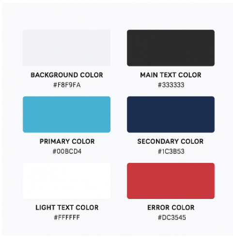
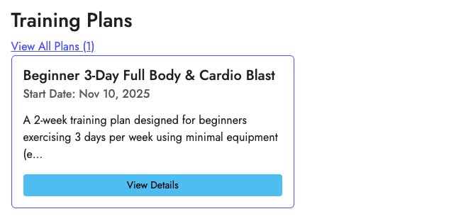
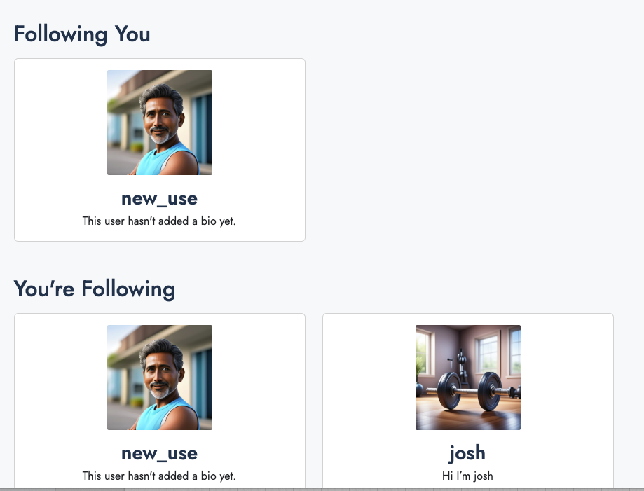
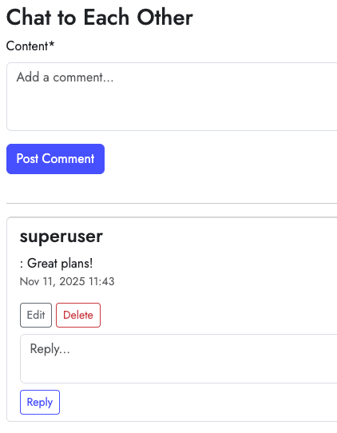

# stride

## Table of Contents

### 1. User Experience
#### a. Purpose of the Website
#### b. User Stories
#### c. Wireframes
#### d. Accessibility
#### e. Colour Palette
#### f. Fonts
#### g. Features
#### h. User Interface Design Decisions

### 2. Database Desgin
#### a. Schema
#### b. ERD Diagram
#### c. User Flow

### 3. Technologies Used
#### a. Software Used
#### b. APIs Used
#### c. Other Code Credits

### 4. Deployment Information
#### a. Version Control
#### b. Deployment to Heroku
#### c. Clone the Code Locally

### 5. Testing (See seperate Testing.md file)

### 6. Security Settings

### 7. Credits

### 8. Improvements for Future Releases

### 9. Things I have learnt

### 10. Concerns for the future/if I was to put this project live

## 1. User Experience
### a. Purpose of the Website

This is a web application designed to help people create personalised exercise plans with the help of AI taking into account any injuries or limitations, such as a long term knee injury. The application also strives to create a community where you can follow people and comment on their profiles. The idea is that the site will be a positive place that helps people stay fit, healthy, happy and connected, even if they have injuries and/or long term limitations in their exercise. The site is designed to one day make it compatible with smart watches (eg Garmin or Apple) to be able to upload your exercise plan on to your watch to follow. This is why the AI returns the plans in a JSON format.

### b. User Stories

#### First Story

User A has a long term knee injury that means they avoid jumping and high impact exercises. Every exercise plan they find online seems to suggest this as part of their routines and they are looking for a plan that will adapt to their specific needs.

 - They needs to be able to tell the AI that generates the plan about their specific exercise needs for a plan.
 - It is useful for them if the site can remember their injury and build long term progression goals/plans.

 *Acceptance Criteria*  - Users need to be able to save information to their profiles
                        - The Plans need to draw on this information when they are created

#### Second Story

User B enjoys personally adapted plans but also wants to reach out to other people, connect and talk about the challenges they face exercising.

- They need to be able to hold back to back conversations with people on comments

*Acceptance Criteria*   - Users need to be able to leave comments and replies on profiles once connected (following/followed by)
                        - They need to be able to view other users plans.

#### Third Story

User C is part of a friendship group that enjoy exercise. They want to be able to see and discuss their friends' plans.

- They need to be able to find the profiles they follow easily and comment on profiles.

*Acceptance Criteria*   - Users need to be able to follow each other
                        - Users need to be able to search for other peoples usernames

#### Fourth Story

User D is an influencer with a community of followers. They want to be able to show their followers the plans they are following.

- They need to be able to expand on their profile to communicate to their followers.
- They also need to be able to comment on their own profiles as well as other peoples to help engagement.

*Acceptance Criteria*   - Users need to be able to comment on their own profile
                        - Users need to be able to comment on their own profiles

#### Fifth Story

User E is training for a local marathon (eg London Marathon) and wants to see what training other people are doing.

- They need to be able to search the site by events or key words in events.

*Acceptance Criteria*   - Users should be able to search for a key word (eg London) in the goal events.

### c. Wireframes

I tried to keep the design of the site fairly simple and this is reflected in the wireframes. 

#### Links to Wireframes

[Home Page](docs-images/wireframes/home-page.png)

[Connections Page](docs-images/wireframes/connections-page.png)

 - Note that this page changes, if you are not signed in it shows all profiles, but in the same design as the connections page.

[My profile Page](docs-images/wireframes/my-profile-page.png)

[Training Plan Detail Page](docs-images/wireframes/training-plan-detail.png)

[Profile Edit Form](docs-images/wireframes/profile-edit-form.png)

[Plan Generation Form](docs-images/wireframes/plan-generation-form.png)

[Plan Generation Screen](docs-images/wireframes/plan-generation-screen.png)

### d. Accessibility

Because the site is based around the idea of people having limitations with exercise I feel that accessibility is really important to the ethos of this site. Therefore I have designed a high contrast colour palette, a clear design and have taken in to account screen readers. I have also ensured you can navigate the site using the keyboard.

The site also works responsively across different screen sizes.

### e. Colour Palette

The colour scheme for this site was chosen to look smart and professional, but also score strongly for contrast and accessibility. It was altered after Lighthouse Testing. 

(image generated by chatgpt)

### f. Fonts

For this project I used Google Fonts Jost, designed to be clear and readable.

### g. Features

The site has several features.

The primary feature is the ability to create bespoke training plans that take injuries or limitations in to account. The plans are created by AI powered by Anthropic. The information for the plans is gathered on people's profiles and a short generation plan form, then used by the AI to design plans.

It also allows users to follow other people and be followed by other people. This is useful if you want to see other training plans or get an understanding of other people's exercise routines. You follow someone from a button on the public version of their profile. They can approve the request.

You can comment on profiles to communicate with each other, and the comments have full CRUD functionality. This is only possible when you are connected to another user (followed by or following).

There are search buttons for target events and usernames. These both work if you enter one word that is found in a profile's username or target event. For example, if you search 'Brighton' in the goal event it will flag anyone who has a goal of 'Brighton Marathon' or 'Brighton 10k.'

## 2. Database Desgin

I tried to keep that data as simple as possible. This project could be quite complicated because there is data entered by the user, as well as data generated by the AI. The other reason for striving for simplicity is to try and keep the AI call as simple as possible to keep costs down.

### a. Schema

| Model | Key Fields & Relationships | Type of Relationship | Purpose |
|--------|-----------------------------|----------------------|----------|
| User (Django built-in) | username, password, is_active | 1-to-1 with UserProfile | Django standard user |
| UserProfile | user (FK to User), display_name, bio, profile_picture, goal_event, injuries_and_limitations, fitness_level, exercise_days_per_week | 1-to-1 with User. 1-to-Many with TrainingPlan. Many-to-Many with FollowRequest | All info about a user that is used for plans and to display a profile to other users |
| Training Plan | user (FK to UserProfile), start_date, json_plan_data (The AI-generated content), minor_injuries, plan_preferences | Many-to-1 with UserProfile | Stores all data related to a specific training program generated by the AI |
| Comment | author (FK to UserProfile), parent (FK to Comment), content, approved | Many-to-1 with UserProfile (both as author and recipient) | Allows users to leave comments and replies on other user profiles |
| FollowRequest | from_user (FK to UserProfile), to_user (FK to UserProfile), accepted | Creates many to many relationships between user profiles | Manages the connection status (following/follower) between users |

### b. ERD Diagrams

I have drawn an ERD diagram to explore the relationships between the different sets of data. I have tried to keep it simple, the different fields are broken down in more detail in the schemas.

## 3. Technologies Used

### a. Software Used

The site is built using Python 3.12, HTML 5 and CSS 3 on Django 5.2.7. There is a full list of sofware dependencies and current versions in the requirements.txt file.

Celery 5.5.3 is used to manage the async task of generating a training plan, Redis 6.4.0 is used to manage the messaging with celery when the AI task is triggered.

These softwares may need updating sometimes.

### b. APIs Used

The site uses Anthropic AI API, model claude-haiku-4-5-20251001. The software associated with it sometimes needs updating.

It also uses Cloudinary to store profile pictures that users upload.

## 4. Deployment Information

### a. Version Control

Regular Commits have been made to github which reflect the projects development with bug fixes and new features being added. The url is [link to github repo](https://github.com/christinalicence/stride).

### b. Deploy to Heroku

The site is deployed through Heroku. Seperate Dynos are used for hosting the site and running the API call process.

Before deploying ensure

- `DEBUG` is set to `False` in `settings.py`.
- No secrets are committed — API keys, database URLs, and secret keys are all stored in `.env`, which is included in `.gitignore`, so they are not on the GitHub repo.
- All the config vars are set correctly in Heroku:
  - `DATABASE_URL`
  - `DJANGO_SECRET_KEY`
  - `REDIS_URL`
  - `ANTHROPIC_API_KEY`
  - `CLOUDINARY_API_KEY`
Once this is done. 

Run the commands to update the github repo 
> `git add`
> `git commit -m "change you have made"`
> `git push`

Then when logged in on Heroku go to the deployment section to 'Deploy Branch,' then to 'Open App.' This should open an up to date version of Stride. 

For error checking use the logs in Heroku. This will also show if there are any issues with the celery or redis functions. 

Note that if you want to use local deployment this needs 3 steps, in 3 seperate terminals

- Terminal one can start Redis with the command `redis-server`
- Terminal two can start Celery with the command `celery -A strideai worker -l info` 
- Once this is done in Terminal three run `python3 manage.py runserver`
 *This assumes that you are also using Python 3 and have named your project folder strideai, otherwise replace `python3` and `strideai` in these commands*

 This can be useful to spot any issues as each terminal will log the actions of the software they are running.

### c. Clone the Code Locally

In order to undertake any work on the site the code can be cloned locally from github. The url to do this is [gituhb code url](https://github.com/christinalicence/stride.git). You can enter this to VSCode to clone it. 

This project was set up in a virtual environment (.venv), with all the dependencies listed in requirements.txt. The API keys, secret keys and database url are all in my gitignore and heroku's config vars.

## 5. Testing (See separate Testing.md file)

See Testing.md file for an expalanation of how the site has worked against the user stories, the automated testing strategy and manual testing that has been carried out.

## 6. Security Settings

The API key for Anthropic, databse url, Django secret key and Redis key are all stored in .env and have been included in my gitignore, so not uploaded to github. Debug is set to false in settings.py.

A security concern tht is ongoing is not having email verification (so people could make multiple accounts and overuse the API leading to high costs). This is something I would look to add in the future.

7. ## Credits

All profile images were generated by Apple image playground.

Color scheme image was generated by chatpgpt.

The favicon was generated by [favicon.io](https://favicon.io/)

8. ## Improvements for Future Releases

- The biggest plan for the future of this site is to make it compatible with smart watches so that you can save your workouts to the watches and the watches can evaluate your performance during the workouts. This is why the training plans are returned in a json format from the AI, to allow them to be uploaded to a watch or other tracker. You could also do a lighter version by allowing syncing with a phone app.

- I'd like to set up a private messaging system between users. I feel that this would be a useful social aspect for the site.

- I'd like to allow comments to contain photos and for all photos associated with someone's profile to be saved in an area that is easy to access.

- I'd like to be able to widen the comments to include ing on people's plans.

- I'd like to put proper email verification on to the program to improve security. This is a feature I would add before making the website live.

- I'd like to be able to filter the input that people make to the AI more effectively. I believe there are ways of using the AI to do this, which I would like to explore in the future. This should filter out things that aren't relevant to a fitness app - at the moment people can enter anything in to the free text, the AI mostly just ignore irrelevant things, but the site has no control over this.

- I would also improve the visual look of the site with more photos and graphics.

9. ## Insights from Developing This Project

Using the Anthropic AI has been a really interesting learning experience. I have found that it is a little temperamental to work with and you have to refine your code to different outcomes it might give - an example of this is that it is very inconsistent with how it records rest days. Sometimes it says 'rest days' and sometimes it says 0 or null. I have had to incorporate these different outcomes in to my code to give a consistent user experience. Ultimately to solve this I gave the AI more specific instructions on how to record a rest day.

Another aspect I hadn't really thought about before is the amount of information that goes to and from the AI for this project and how quickly it would add up if the site was live. It could end up quite costly quickly. I think if it was live I would need to limit the amount of API calls per user and implement a payment system (either monthly or a small fee per plan). Obviously if it was paid for I'd be relying on the AI for a consistently good output, although I do think if I could sync it with smartwatches it is a service that people may pay for. 

The other thing I learnt during the course of this project was about planning and using test driven development. Using TDD helps to better plan functions which helps me to be more direct with my code.

10. ## Concerns for the future/if I was to put this project live

The thing that would worry me most about putting this project live is the potential for people to make lots of plans and build up the costs for using the AI API. I would look to solve this issue before making the site live.

At the moment I also don't have proper email validation and security, which I would definitely implement if I were to put this project live to help with the security and potential for people to misuse the AI. 

I would not consider putting this project live without email verification, plan limiting or payment.