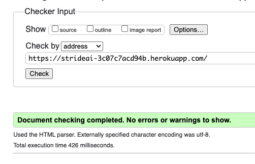
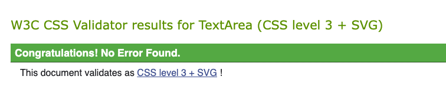
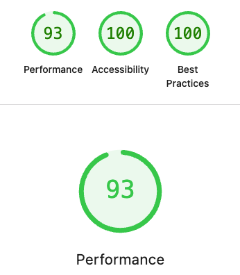
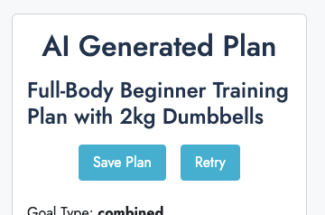
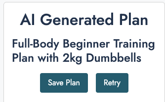
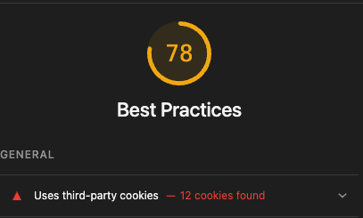
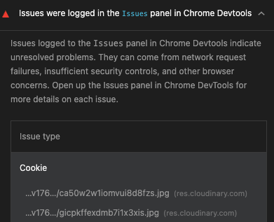
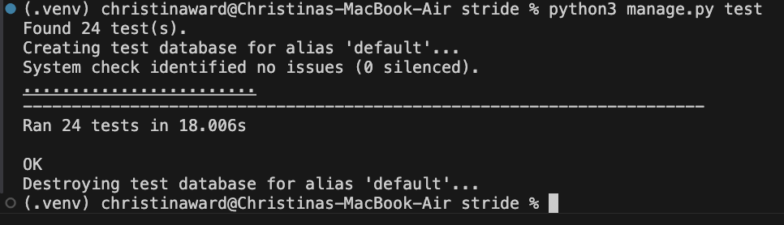

# Testing for Stride

## 1. Testing Objectives Against User Stories

## 2. Manual Testing
### a. Testing Using Code Validators
### b. Accessibility and Performance Testing
### c. Manual Testing of Features
### d. Manual Testing of Responsiveness
### e. User Testing/Feedback

## 3. Automated Testing using Django

## 4. Test Driven Development

## 1. Testing Objectives Against User Stories

For full user stories please see README.md

| User Story | Objective/Test | Expected Result | Tests Used/Proof of Implementation |
| :--- | :--- | :--- | :--- |
| First Story (Long Term Injury) | AI can be aware of the injury and generate a plan | JSON output from AI should reference the injury | The forms for injury input have **automated tests**. The AI output was **tested manually** extensively. |
| Second Story (Hold Conversations via comments) | Users can view and post a chain of comments | Reply structure should be visible on a connected profile | There are **automated tests** for comments and replies |
| Third Story (See friends' plans) | Can follow people and see profiles with plans | Follow requests can be accepted and plans seen when authenticated | There are **automated tests** for follow requests |
| Fourth Story (Influencer communicating to followers) | Can comment on their own profiles | Logic must allow commenting on own profiles | This is checked in the **automated test** and **manually**. |

For the automated tests please see the tests_forms.py and tests_views.py. The function of each test is explained.

## 2. Manual Testing
### a. Testing Using Code Validators

#### HTML validator

All the HTML pages were passed the [W3C HTML Validation Tester](https://validator.w3.org/)

After some research I found it better to enter the urls in to the validator rather than the code as it wasn't recognising some of the Django tags. 

All pages passed when entered this way.

#### CSS Validator

The site passed the [W3C CSS Validation Test](https://jigsaw.w3.org/css-validator/) without errors

#### Python Standards

### b. Accessibility and Performance Testing

The pages were tested using Google Lighthouse for performance, accessibility and Best Practice.

Here is the report for the home page

Lighthouse did uncover an issue on my traning plans where ther buttons colours used didn't have sufficient contrast.

As accessibility is a core part of the ethos of this site I changed the buttons to a darker colour.

It also picked up on Cloudinary leaving 3rd party cookies as part of it's best practice report on profile pages where an image was being stored.

It also showed that it was leaving a marker for the cookies on the issues panel

As I feel that Cloudinary is a useful part of this site I hae decided not to change it, despite these warnings.

These were the only issues across the site found by Lighthouse.

### c. Manual Testing of Features

#### Training Plan Creation

This has been tested manually and plans are generated.

It also has several automated tests for the forms associated with gathering information for the tests and the test regeneration functions for making new tests.

#### Following Other people

This has been tested manually.

There are also automated tests to ensure that follow requests can be sent and approved.

#### Comments, including CRUD functions

This has been tested manually

There are also automated tests to ensure comments can be added and deleted by the author.

#### Profile search for username and goals

These have been tested manually

There are also automated tests for the search functions, including if the search button is pressed when the boxes are blank (which brings up all profiles)

### d. Manual Testing of Responsiveness

The site has been tested using Lighthouse, Android phones, iphones and an ipad. No issues were found for responsiveness, I kept this simple by using Bootstrap responsive setups. 

### e. User Testing/Feedback

#### First Feedback

I recieved quite a lot of user feedback when it was tested about 60% through development.

- The profile/edit/profile and generate plan process was too complex. I needed to simplify it in order to make it more user friendly and be able to find the key fields more easily, especially long term injuries/limitations. 

- Also the views of the profiles needed to be different, more detail was needed when you follow someone.

- Input fields, ie weight and target date need to be managed more clearly in the forms. There needs to be a clear error message if any of the inputs are not accepted.

- Several bugs were also uncovered:
    - You can generate training plans on anyone's profile.
    - You can follow yourself.
    - Changes weren't being saved after editing your profile.

These were all fixed.

#### Second Feedback

I did another bit of user testing when I around 95% through development. Again there were some suggestions for improvement.

- I had removed the height, weight and current fitness levels from the profiles for simplicity, but they were quite critical of this because it meant the plans were not taking these important factors in to considereation. The line between simplicity and functionality in this project has often been difficult to navigate.

- They also found that you could reply to comments on people's profiles that you weren't following if there was already a comment. I fixed this through improving the logic. You can only comment/reply when you are connected to someone (folled by/following).

- They also found that warnings/messages were sometimes appearing twice on the 'My Profile' Page.

## 3. Automated Testing using Django

There are lots of tests written and contained in the files test_forms.py, test_tasks.py and test_views.py. They have been designed to ensure that the site works against user stories, but also to make sure that the site is robust and can function when unexpected things happen.

All automated tests are passing when run.

## 4. Test Driven Development

I adopted test driven development part way through this project and started to understand the real benefits of this approach. It has made my code more robust and less prone to errors. It also makes me think about exactly what function I want it to perform before writing it.

