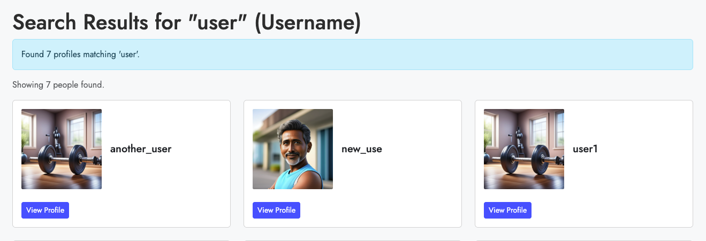
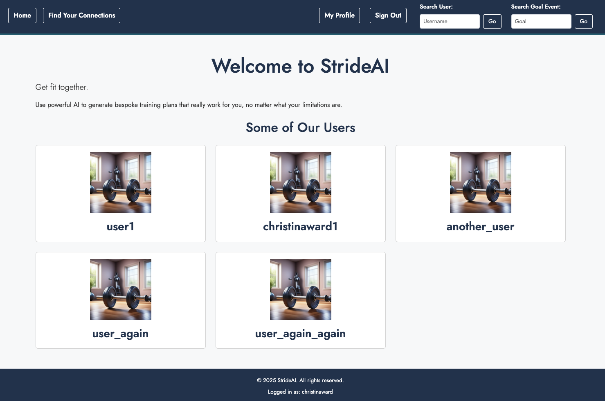
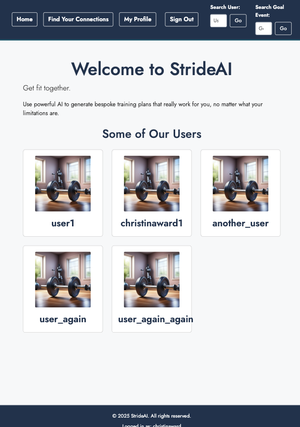
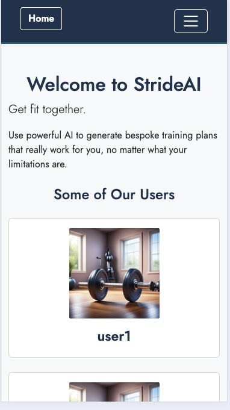
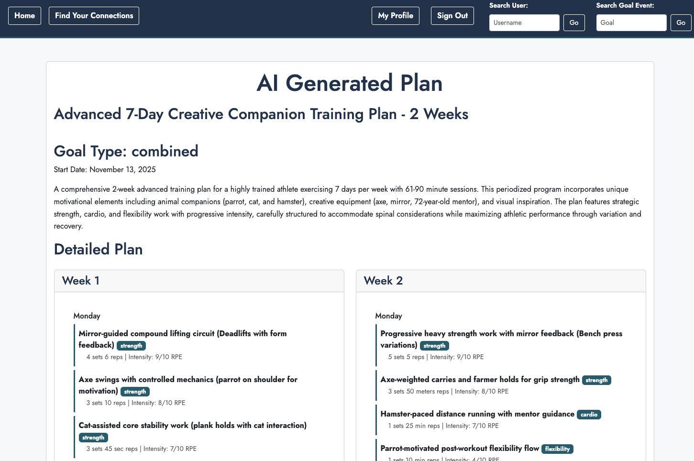
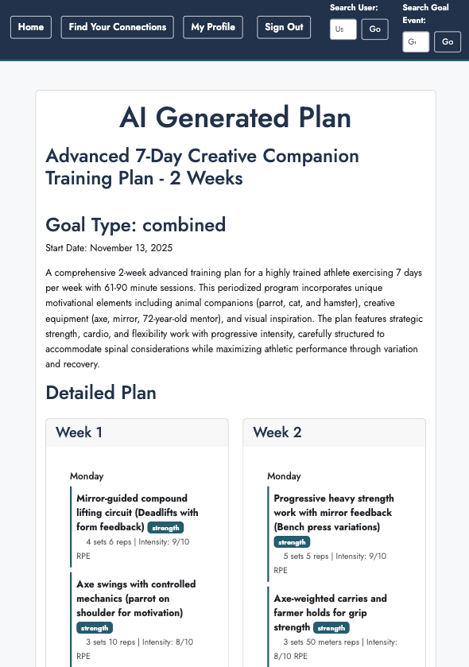
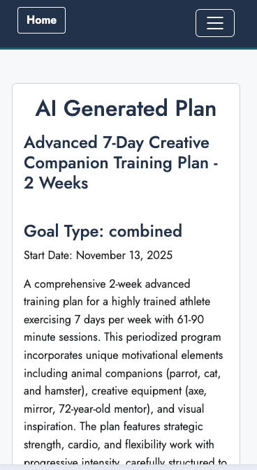

# Testing for Stride

## 1. Testing Objectives Against User Stories

## 2. Manual Testing

### a. Testing Using Code Validators

### b. Accessibility and Performance Testing

### c. Manual Testing of Features

### d. Manual Testing of Responsiveness

### e. User Testing/Feedback

## 3. Automated Testing using Django

## 4. Test Driven Development

## 1. Testing Objectives Against User Stories

For full user stories please see README.md

| **User Story** | **Acceptance Criteria** | **Automated Tests** | **Manual Tests / Proof** |
|-----------------|--------------------------|----------------------|---------------------------|
| **First Story (Long Term Injury / Personalized Plan)** | Users need to be able to save information to their profiles. The Plans need to draw on this information when they are created. | `test_forms.py`: `TestUserProfileForm` tests injury input. | AI output was tested manually extensively to ensure injury constraints are respected. |
| **Second Story (Hold Conversations via Comments)** | Users need to be able to leave comments and replies on profiles once connected. Users need to be able to view other users’ plans. | `test_forms.py`: `TestCommentForm` tests comment and replies. | This has also been tested manually. |
| **Third Story (See Friends’ Plans & Connect)** | Users need to be able to follow each other. Users need to be able to search for other peoples’ usernames. | `test_views.py`: `test_send_follow_request_success` and `test_approve_follow_request_success`. The usernames is achieved with `test_views.py`: `def test_search_profiles_by_username(self)`. | Manual testing has been undertaken. |
| **Fourth Story (Influencer Communicating / Self-Comment)** | Users need to be able to comment on their own profile. | `test_forms.py`: `TestCommentForm`. | This has been tested manually. |
| **Fifth Story (Marathon Training / Event Search)** | Users should be able to search for a keyword (e.g., “London”) in the goal events. | `test_views.py`: `def test_search_profiles_by_goal_event(self)`. | This has been tested manually. |

Manual testing has been done across these tests (see manual features testing section), but the only part of the user stories which hasn't been tested with an automated test is the AI output for the plan as I couldn't find a comprehensive test. I did put error warnings in for if the AI failed.

## 2. Manual Testing

### a. Testing Using Code Validators

#### HTML validator

All the HTML pages were passed the [W3C HTML Validation Tester](https://validator.w3.org/)

After some research I found it better to enter the urls in to the validator rather than the code as it wasn't recognising some of the Django tags.

All pages passed when entered this way. There were some 'trailing slash' reports after I used a code formatter, but I chose to ignore these.

#### CSS Validator

The site passed the [W3C CSS Validation Test](https://jigsaw.w3.org/css-validator/) without errors

#### Python Standards

I made sure that all my code was to [PEP8](https://peps.python.org/pep-0008/) standards by downloading Flake8 and Black. I had several 'long line' errors to fix, but worked through them! I restricted my line limit to 88 characters, with shorter docstring limits of 72. The limit is set in my settings.json to work with Black. After taking a look at the PEP8 guidelines I felt this was appropriate given their section on line length and some people preferring longer lines. I checked the docstrings manually.

I initially set Black to save on format, but found this caused issues with my HTML pages, which it also formatted. My solution to this was to create a settings.json file and disable the setting to reformat on save. In order to reformat any file in the project you now run Black file-path/yourfile in the terminal.

### b. Accessibility and Performance Testing

The pages were tested using Google Lighthouse for performance, accessibility and Best Practice.

Here is the report for the home page

Lighthouse did uncover an issue on my training plans where the button colours used didn't have sufficient contrast.

As accessibility is a core part of the ethos of this site I changed the buttons to a darker colour.

It also picked up on Cloudinary leaving 3rd party cookies as part of it's best practice report on profile pages where an image was being stored.

It also showed that it was leaving a marker for the cookies on the issues panel

As I feel that Cloudinary is a useful part of this site I have decided not to change it, despite these warnings.

These were the only issues across the site found by Lighthouse.

### c. Manual Testing of Features

#### Training Plan Creation

This has been tested manually and plans are generated.

It also has several automated tests for the forms associated with gathering information for the tests and the test regeneration functions for making new tests.

#### Following Other people

This has been tested manually.

There are also automated tests to ensure that follow requests can be sent and approved.

#### Comments, including CRUD functions

This has been tested manually. You can only comment or reply on profiles that you are connected to (following or followed by)

There are also automated tests to ensure comments can be added and deleted by the author.

#### Profile search for username and goals

These have been tested manually

There are also automated tests for the search functions, including if the search button is pressed when the boxes are blank (which brings up all profiles)

### d. Manual Testing of Responsiveness

The site has been tested using Lighthouse, Android phones, iphones and an ipad. No issues were found for responsiveness, I kept this simple by using Bootstrap responsive setups.

I am not going to link all the images here, but for the home page it adapts as below

Desktop

ipad

iphone

The plans are as below

Desktop

ipad

iphone

Because the site is built using Bootstrap it adapts in a similar way across the different pages.

### e. User Testing/Feedback

#### First Feedback

I received quite a lot of user feedback when it was tested about 60% through development.

- The profile/edit/profile and generate plan process was too complex. I needed to simplify it in order to make it more user friendly and be able to find the key fields more easily, especially long term injuries/limitations.

- Also the views of the profiles needed to be different, more detail was needed when you follow someone.

- Input fields, ie weight and target date need to be managed more clearly in the forms. There needs to be a clear error message if any of the inputs are not accepted.

- Several bugs were also uncovered:
  - You can generate training plans on anyone's profile.
  - You can follow yourself.
  - Changes weren't being saved after editing your profile.

These were all fixed.

I decided to eliminate some fields to make the input simpler - weight, height, age and gender. The site was too complicated, making the user flow difficult.

#### Second Feedback

I did another bit of user testing when I was around 95% through development. Again there were some suggestions for improvement.

- The entry for the 'exercise duration' was free text, which meant that illogical amounts could be entered. I fixed this by turning it in to a dropdown.

- I had removed the height, weight and current fitness levels from the profiles for simplicity, but they were quite critical of this because it meant the plans were not taking these important factors in to consideration. The line between simplicity and functionality in this project has often been difficult to navigate. After some thought my fix for this was to put in a 'current fitness level' dropdown to give the AI a bit more info while still keeping it simple.

- They also found that you could reply to comments on people's profiles that you weren't following if there was already a comment. I fixed this through improving the logic. You can only comment/reply when you are connected to someone (followed by/following).

- They also found that warnings/messages were sometimes appearing twice on the 'My Profile' Page. I fixed this by changing the logic in the view, where messages were accidentally called twice.

## 3. Automated Testing using Django

There are lots of tests written and contained in the files test_forms.py, test_tasks.py and test_views.py. They have been designed to ensure that the site works against user stories, but also to make sure that the site is robust and can function when unexpected things happen.

All automated tests are passing when run.

The tests cover almost all the code, apart from the AI output, which I haven't found a robust test for. This needs to be done manually.

## 4. Test Driven Development

I adopted test driven development part way through this project and started to understand the real benefits of this approach. It has made my code more robust and less prone to errors. It also makes me think about exactly what function I want it to perform before writing it.
